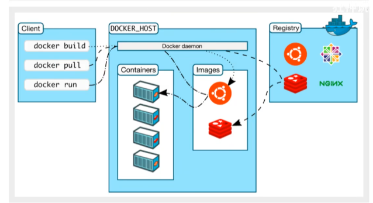
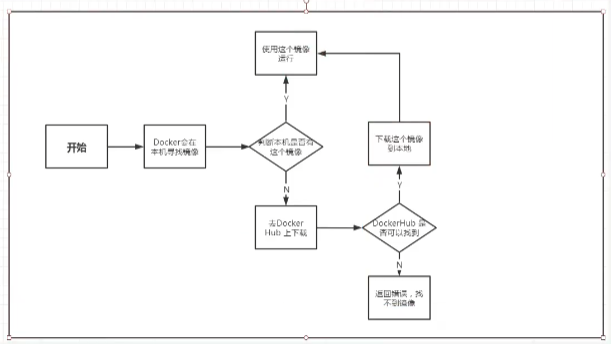
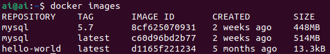
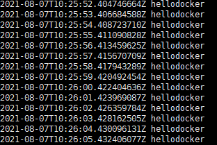
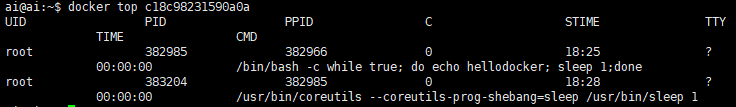

# 学习大纲

## Docker 结构



**镜像（image):**类似一个模板，通过这个模板来创建容器

**容器(container):** 运行一个或者一个组应用，通过镜像来创建

**仓库：**存放镜像的地方，仓库分为共有仓库和私有仓库：Docker Hub、阿里云等

## Docker安装

跟着官方教程走即可，以ubuntu21.04为例：

- **安装依赖项**：

~~~shell
sudo apt-get update
sudo apt-get install \
     apt-transport-https \
     ca-certificates \
     curl \
     gnupg \
     lsb-release
~~~

- **添加官方公钥**：

```shell
curl -fsSL https://download.docker.com/linux/ubuntu/gpg | sudo gpg --dearmor -o /usr/share/keyrings/docker-archive-keyring.gpg
```

国外源可能无法下载，自行配置科学上网，或改成阿里云镜像地址

添加仓库源(稳定版)

```shell
echo \
  "deb [arch=amd64 signed-by=/usr/share/keyrings/docker-archive-keyring.gpg] https://download.docker.com/linux/ubuntu \
  $(lsb_release -cs) stable" | sudo tee /etc/apt/sources.list.d/docker.list > /dev/null
```

- **安装**：

```shell
sudo apt-get update
sudo apt-get install docker-ce docker-ce-cli containerd.io
```

默认最新版，安装指定版本使用如下命令：

```shell
apt-cache madison docker-ce 
#显示结果如下：
docker-ce | 5:20.10.8~3-0~ubuntu-hirsute | https://download.docker.com/linux/ubuntu hirsute/stable amd64 Packages
 docker-ce | 5:20.10.7~3-0~ubuntu-hirsute | https://download.docker.com/linux/ubuntu hirsute/stable amd64 Packages
 docker-ce | 5:20.10.6~3-0~ubuntu-hirsute | https://download.docker.com/linux/ubuntu hirsute/stable amd64 Packages
```

指定版本安装

```shell
sudo apt-get install docker-ce=<VERSION_STRING> docker-ce-cli=<VERSION_STRING> containerd.io
```

- **卸载**：

```shell
sudo apt-get purge docker-ce docker-ce-cli containerd.io
```

删除数据

```shell
sudo rm -rf /var/lib/docker
sudo rm -rf /var/lib/containerd
```



## Docker命令

**可能遇到的问题：**

```
Got permission denied while trying to connect to the Docker daemon socket at unix:///var/run/docker.sock:
```

**解决方法：**

~~~shell
sudo groupadd docker          #添加docker用户组
sudo gpasswd -a $XXX docker   #检测当前用户是否已经在docker用户组中，其中XXX为用户名，例如我的，liangll
sudo gpasswd -a $USER docker  #将当前用户添加至docker用户组
newgrp docker                 #更新docker用户组
~~~

### 帮助命令

```shell
docker version
docker info
docer --help
```

### 镜像命令

**docker images #列出本地主机上的所有镜像**



```shell
REPOSITORY    TAG       IMAGE ID       CREATED        SIZE
hello-world   latest    d1165f221234   5 months ago   13.3kB
#解释
REPOSITORY  #镜像仓库源
TAG  		#镜像标签
IMAGE ID 	#镜像ID
CREATED 	#创建时间
SIZE		#大小

#可选项
-a, --all #列出所有镜像
-q, --quiet #静默/简略显示，仅显示ID
```

**docker search  #搜索镜像**

```shell
docker search mysql
docker search mysql --filter=STARS=3000 #列出star数量在3000以上的
```

**docker pull #下载镜像**

```shell
proxychains docker pull mysql
ProxyChains-3.1 (http://proxychains.sf.net)
Using default tag: latest
latest: Pulling from library/mysql
33847f680f63: Pull complete 
5cb67864e624: Pull complete 
1a2b594783f5: Pull complete 
b30e406dd925: Pull complete 
48901e306e4c: Pull complete 
603d2b7147fd: Pull complete 
802aa684c1c4: Pull complete 
715d3c143a06: Pull complete 
6978e1b7a511: Pull complete 
f0d78b0ac1be: Pull complete 
35a94d251ed1: Pull complete 
36f75719b1a9: Pull complete 
Digest: sha256:8b928a5117cf5c2238c7a09cd28c2e801ac98f91c3f8203a8938ae51f14700fd
Status: Downloaded newer image for mysql:latest
docker.io/library/mysql:latest
```

```shell
docker pull mysql
等价于
docker pull docker.io/library/mysql:latest
```

也可以上docker hub上搜索下载 ，可以查看版本号等相关信息

```shell
#指定版本下载
proxychains docker pull mysql:5.7
ProxyChains-3.1 (http://proxychains.sf.net)
5.7: Pulling from library/mysql
33847f680f63: Already exists #分层下载机制
5cb67864e624: Already exists 
1a2b594783f5: Already exists 
b30e406dd925: Already exists 
48901e306e4c: Already exists 
603d2b7147fd: Already exists 
802aa684c1c4: Already exists 
5b5a19178915: Pull complete 
f9ce7411c6e4: Pull complete 
f51f6977d9b2: Pull complete 
aeb6b16ce012: Pull complete 
Digest: sha256:be70d18aedc37927293e7947c8de41ae6490ecd4c79df1db40d1b5b5af7d9596
Status: Downloaded newer image for mysql:5.7
docker.io/library/mysql:5.7
```
**docker rmi  删除镜像**

```shelll
docker rmi -f 镜像ID 				  #删除单个
docker rmi -f 镜像ID 镜像ID 镜像ID	#删除多个
docker rmi -f $(docker images -aq)	#删除全部
```

### 容器命令

有了镜像才能创建容器，首先下载一个centos镜像来测试

```shell
docker pull centos
```

**新建容器并启动**

```shell
docker run [可选参数] imageID
#参数说明 
--name="Name" #给容器起个名字用来区分
-d #detach，后台方式运行
-it #交互方式运行，进入容器后会新开一个终端，不会显示正在执行的任务或打印相关日志
-p #指定端口，用于端口映射 
	-p 主机端口:容器端口（常用）
	-p ip:主机端口:容器端口
-P #随机端口
```

**启动并进入容器：**

```shell
docker run -it centos /bin/bash
```

**列出所有运行的容器**


```shell
docker ps 命令
不加参数 #列出当前正在运行的容器
-a 		#列出所有容器，包括历史运行过当前已不再运行的
-n=?    #列出最近?个
-q 		#只显示容器编号
```

**退出容器**

```shell
exit		#停止容器并退出
Ctrl + P + Q	#不停止容器退出
```

**删除容器**

```shell
docker rm 容器ID #删除指定容器，不能删除正在运行的容器，可加-f强制删除
docker rm -f $(docker ps -aq) #删除所有容器
docker ps -a -q | xargs docker rm #删除所有容器
```

**启动和停止容器**

```shell
docker start   	#启动容器
docker restart  #重启容器
docker stop		#停止当前正在运行的容器
docker kill		#强制停止当前容器
```

### 常用其他命令

**后台启动容器**

```shell
#命令 docker run d 镜像名
docker run -d centos

#发现docker停止了，因为容器内没有在运行的进程
docker run -d centos /bin/bash -c "while true; do echo hellodocker; sleep 1;done"
```

**查看日志**

```shell
docker logs -f -t --tail n 容器ID

#Options:
      --details        Show extra details provided to logs
  -f, --follow         Follow log output
      --since string   Show logs since timestamp (e.g. 2013-01-02T13:23:37Z) or relative (e.g. 42m
                       for 42 minutes)
  -n, --tail string    Number of lines to show from the end of the logs (default "all")
  -t, --timestamps     Show timestamps
      --until string   Show logs before a timestamp (e.g. 2013-01-02T13:23:37Z) or relative (e.g.
                       42m for 42 minutes)


 docker logs -f -t --tail 10 c18c98231590a0a16
```



**查看容器中的进程信息**

```shell
docker top 容器ID
```



**查看镜像的元数据**

```
docker inspect 容器ID
```

```shell
ai@ai:~$ docker inspect c18c98231590
[
    {
        "Id": "c18c98231590a0a167a0dcb62d35da75b4ebea8e405f0ec6017ecbcdcdf34101",
        "Created": "2021-08-07T10:25:20.091556198Z",
        "Path": "/bin/bash",
        "Args": [
            "-c",
            "while true; do echo hellodocker; sleep 1;done"
        ],
        "State": {
            "Status": "running",
            "Running": true,
            "Paused": false,
            "Restarting": false,
            "OOMKilled": false,
            "Dead": false,
            "Pid": 382985,
            "ExitCode": 0,
            "Error": "",
            "StartedAt": "2021-08-07T10:25:20.341179956Z",
            "FinishedAt": "0001-01-01T00:00:00Z"
        },
        "Image": "sha256:300e315adb2f96afe5f0b2780b87f28ae95231fe3bdd1e16b9ba606307728f55",
        "ResolvConfPath": "/var/lib/docker/containers/c18c98231590a0a167a0dcb62d35da75b4ebea8e405f0ec6017ecbcdcdf34101/resolv.conf",
        "HostnamePath": "/var/lib/docker/containers/c18c98231590a0a167a0dcb62d35da75b4ebea8e405f0ec6017ecbcdcdf34101/hostname",
        "HostsPath": "/var/lib/docker/containers/c18c98231590a0a167a0dcb62d35da75b4ebea8e405f0ec6017ecbcdcdf34101/hosts",
        "LogPath": "/var/lib/docker/containers/c18c98231590a0a167a0dcb62d35da75b4ebea8e405f0ec6017ecbcdcdf34101/c18c98231590a0a167a0dcb62d35da75b4ebea8e405f0ec6017ecbcdcdf34101-json.log",
        "Name": "/objective_wilson",
        "RestartCount": 0,
        "Driver": "overlay2",
        "Platform": "linux",
        "MountLabel": "",
        "ProcessLabel": "",
        "AppArmorProfile": "docker-default",
        "ExecIDs": null,
        "HostConfig": {
            "Binds": null,
            "ContainerIDFile": "",
            "LogConfig": {
                "Type": "json-file",
                "Config": {}
            },
            "NetworkMode": "default",
            "PortBindings": {},
            "RestartPolicy": {
                "Name": "no",
                "MaximumRetryCount": 0
            },
            "AutoRemove": false,
            "VolumeDriver": "",
            "VolumesFrom": null,
            "CapAdd": null,
            "CapDrop": null,
            "CgroupnsMode": "host",
            "Dns": [],
            "DnsOptions": [],
            "DnsSearch": [],
            "ExtraHosts": null,
            "GroupAdd": null,
            "IpcMode": "private",
            "Cgroup": "",
            "Links": null,
            "OomScoreAdj": 0,
            "PidMode": "",
            "Privileged": false,
            "PublishAllPorts": false,
            "ReadonlyRootfs": false,
            "SecurityOpt": null,
            "UTSMode": "",
            "UsernsMode": "",
            "ShmSize": 67108864,
            "Runtime": "runc",
            "ConsoleSize": [
                0,
                0
            ],
            "Isolation": "",
            "CpuShares": 0,
            "Memory": 0,
            "NanoCpus": 0,
            "CgroupParent": "",
            "BlkioWeight": 0,
            "BlkioWeightDevice": [],
            "BlkioDeviceReadBps": null,
            "BlkioDeviceWriteBps": null,
            "BlkioDeviceReadIOps": null,
            "BlkioDeviceWriteIOps": null,
            "CpuPeriod": 0,
            "CpuQuota": 0,
            "CpuRealtimePeriod": 0,
            "CpuRealtimeRuntime": 0,
            "CpusetCpus": "",
            "CpusetMems": "",
            "Devices": [],
            "DeviceCgroupRules": null,
            "DeviceRequests": null,
            "KernelMemory": 0,
            "KernelMemoryTCP": 0,
            "MemoryReservation": 0,
            "MemorySwap": 0,
            "MemorySwappiness": null,
            "OomKillDisable": false,
            "PidsLimit": null,
            "Ulimits": null,
            "CpuCount": 0,
            "CpuPercent": 0,
            "IOMaximumIOps": 0,
            "IOMaximumBandwidth": 0,
            "MaskedPaths": [
                "/proc/asound",
                "/proc/acpi",
                "/proc/kcore",
                "/proc/keys",
                "/proc/latency_stats",
                "/proc/timer_list",
                "/proc/timer_stats",
                "/proc/sched_debug",
                "/proc/scsi",
                "/sys/firmware"
            ],
            "ReadonlyPaths": [
                "/proc/bus",
                "/proc/fs",
                "/proc/irq",
                "/proc/sys",
                "/proc/sysrq-trigger"
            ]
        },
        "GraphDriver": {
            "Data": {
                "LowerDir": "/var/lib/docker/overlay2/a5e4268ec5b763027b848fc8c6856e7c343969886771ebb2973985c1c032a058-init/diff:/var/lib/docker/overlay2/7a41d22469cbb8a712d7d5e234c07f1ccaeaf3556214e3fff6ac869e0afbab60/diff",
                "MergedDir": "/var/lib/docker/overlay2/a5e4268ec5b763027b848fc8c6856e7c343969886771ebb2973985c1c032a058/merged",
                "UpperDir": "/var/lib/docker/overlay2/a5e4268ec5b763027b848fc8c6856e7c343969886771ebb2973985c1c032a058/diff",
                "WorkDir": "/var/lib/docker/overlay2/a5e4268ec5b763027b848fc8c6856e7c343969886771ebb2973985c1c032a058/work"
            },
            "Name": "overlay2"
        },
        "Mounts": [],
        "Config": {
            "Hostname": "c18c98231590",
            "Domainname": "",
            "User": "",
            "AttachStdin": false,
            "AttachStdout": false,
            "AttachStderr": false,
            "Tty": false,
            "OpenStdin": false,
            "StdinOnce": false,
            "Env": [
                "PATH=/usr/local/sbin:/usr/local/bin:/usr/sbin:/usr/bin:/sbin:/bin"
            ],
            "Cmd": [
                "/bin/bash",
                "-c",
                "while true; do echo hellodocker; sleep 1;done"
            ],
            "Image": "centos",
            "Volumes": null,
            "WorkingDir": "",
            "Entrypoint": null,
            "OnBuild": null,
            "Labels": {
                "org.label-schema.build-date": "20201204",
                "org.label-schema.license": "GPLv2",
                "org.label-schema.name": "CentOS Base Image",
                "org.label-schema.schema-version": "1.0",
                "org.label-schema.vendor": "CentOS"
            }
        },
        "NetworkSettings": {
            "Bridge": "",
            "SandboxID": "a2f46d9bf3f2911dd436704c61012bb9bd965de4eae52e2890a27b53d37d0ca5",
            "HairpinMode": false,
            "LinkLocalIPv6Address": "",
            "LinkLocalIPv6PrefixLen": 0,
            "Ports": {},
            "SandboxKey": "/var/run/docker/netns/a2f46d9bf3f2",
            "SecondaryIPAddresses": null,
            "SecondaryIPv6Addresses": null,
            "EndpointID": "c7a3205a32566642b0997578e920385011ffb913f498bf475e3cda67eded4c82",
            "Gateway": "172.17.0.1",
            "GlobalIPv6Address": "",
            "GlobalIPv6PrefixLen": 0,
            "IPAddress": "172.17.0.2",
            "IPPrefixLen": 16,
            "IPv6Gateway": "",
            "MacAddress": "02:42:ac:11:00:02",
            "Networks": {
                "bridge": {
                    "IPAMConfig": null,
                    "Links": null,
                    "Aliases": null,
                    "NetworkID": "bf707f5eb9036120c2af81a63a2e426629729b2956b8d1674e3d73556722303e",
                    "EndpointID": "c7a3205a32566642b0997578e920385011ffb913f498bf475e3cda67eded4c82",
                    "Gateway": "172.17.0.1",
                    "IPAddress": "172.17.0.2",
                    "IPPrefixLen": 16,
                    "IPv6Gateway": "",
                    "GlobalIPv6Address": "",
                    "GlobalIPv6PrefixLen": 0,
                    "MacAddress": "02:42:ac:11:00:02",
                    "DriverOpts": null
                }
            }
        }
    }
]
```

**进入当前正在运行的容器**

```shell
docker exec -it 容器ID /bin/bash #交互式运行，新开终端
docker attach 容器ID #当前终端正在运行的任务
```

**从当前容器拷贝文件到主机上**

```shell
docker cp 容器ID：容器内路径 目的主机路径
```


解决方法：chmod,chown还有sudo


**小结**


docker 常用命令

```shell
Commands:
  attach      Attach local standard input, output, and error streams to a running container
  build       Build an image from a Dockerfile
  commit      Create a new image from a container's changes
  cp          Copy files/folders between a container and the local filesystem
  create      Create a new container
  diff        Inspect changes to files or directories on a container's filesystem
  events      Get real time events from the server
  exec        Run a command in a running container
  export      Export a container's filesystem as a tar archive
  history     Show the history of an image
  images      List images
  import      Import the contents from a tarball to create a filesystem image
  info        Display system-wide information
  inspect     Return low-level information on Docker objects
  kill        Kill one or more running containers
  load        Load an image from a tar archive or STDIN
  login       Log in to a Docker registry
  logout      Log out from a Docker registry
  logs        Fetch the logs of a container
  pause       Pause all processes within one or more containers
  port        List port mappings or a specific mapping for the container
  ps          List containers
  pull        Pull an image or a repository from a registry
  push        Push an image or a repository to a registry
  rename      Rename a container
  restart     Restart one or more containers
  rm          Remove one or more containers
  rmi         Remove one or more images
  run         Run a command in a new container
  save        Save one or more images to a tar archive (streamed to STDOUT by default)
  search      Search the Docker Hub for images
  start       Start one or more stopped containers
  stats       Display a live stream of container(s) resource usage statistics
  stop        Stop one or more running containers
  tag         Create a tag TARGET_IMAGE that refers to SOURCE_IMAGE
  top         Display the running processes of a container
  unpause     Unpause all processes within one or more containers
  update      Update configuration of one or more containers
  version     Show the Docker version information
  wait        Block until one or more containers stop, then print their exit codes
```


## Docker镜像

## 容器数据卷

## DockerFile

## Docker网络原理

## IDEA整合Docker

## Docker Compose

## Docker Swarm

## CI\CD JenKins


